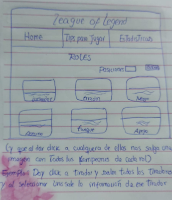
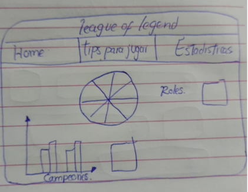
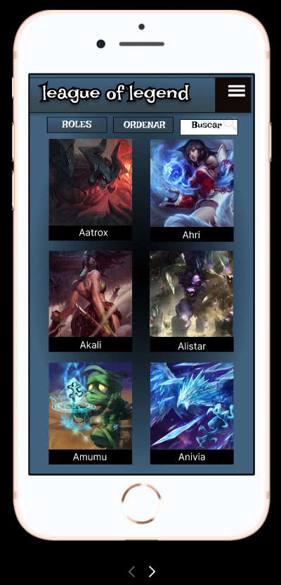
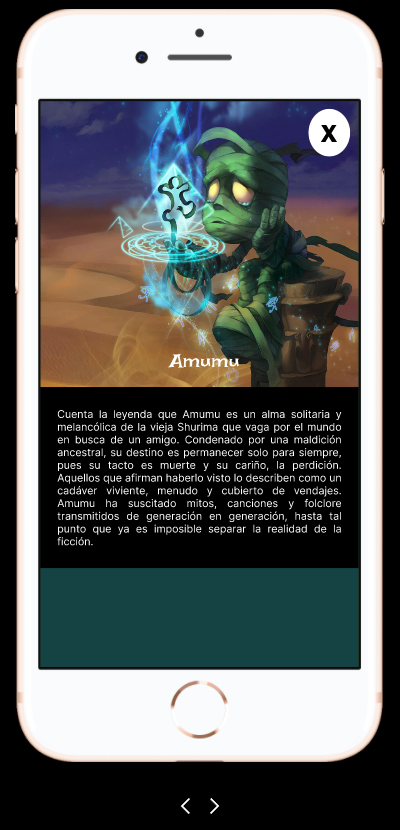
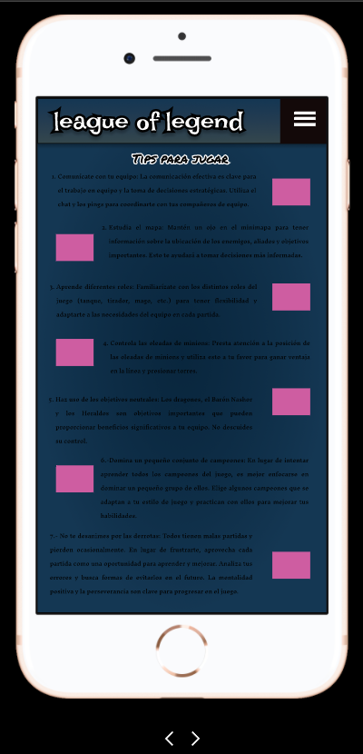
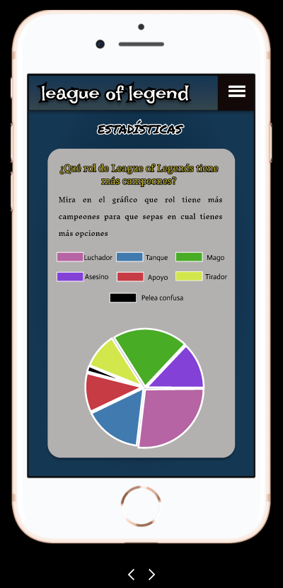

# DATA LOVERS  💚💻  - Pagina Web del Juego Legue of the Leguends  🎮

## Índice

* [1. Definición del Proyecto](#1-definición-del-proyecto)
* [2. Proceso de Diseño y Desarrollo](#2-proceso-de-diseño-y-desarrollo)
* [3. Investigación UX](#3-investigación-ux)
* [4. Diseño UI](#4-diseño-ui)
* [5. Herramientas de Elaboración](#5-herramientas-de-elaboración)

***

## 1. DEFINICIÓN DEL PROYECTO

Nuestra página web es sobre el popular juego en línea Legue of Legends, destinado a los nuevos jugadores o personas interesadas en obtener información resumida del juego para formar sus equipos y conocer que personajes les conviene elegir según el perfil de cada quien. En el sitio web podrás encontrarte con tres segmentos principales: la página Home, la página Tips para Jugar y la página Estadísticas. Asimismo, el sitio web es Responsive Design ya que se ajusta a distintos tamaños puendo acceder desde mobile, tablet o desktop.

A continuación se muestra la imagen final del sitio:

**Bienvenida**

**Página Home**

**Página Tips para Jugar**

**Página Estadísticas**

## 2. PROCESO DE DISEÑO Y DESARROLLO

Para realizar el proyecto nos organizamos utizando las herramientas de Trello para planificar nuestro tiempo y dividir las actividades en tareas más pequeñas haciendo uso de la metodología SCRUM de trabajo ágil. Cabe mencionar que también se uso Figma para hacer el diseño y los prototipos dinámicos que pasaran a detallarse más adelante en la seción de Diseño UI.

El desarrollo total de la página tomo cinco sprints y al cabo de cada uno fuimos tomando en cuenta feedback recibido para hacer mejoras, a continuación pasaré a detallar cada Sprint teniendo en consideración las herramientas usadas

### 2.1. Primer Sprint

Empezamos eligiendo como temática el popular juego en línea Legue of Legends y buscamos mayor información sobre este, también realizamos la investigación de usuario, en la que nos encontramos que nuestros usuarios deberian ser los nuevos jugadores o personas interesadas que no conozcan el juego ya que nuestra página es informativa y la mayor parte de personas que jugaban el juego ya sabian bastante de la data con la que trabajamos y no les interesaba visitar la página. De esta forma, nos dimos cuenta que las personas interesadas en la página eran aquellas que no conocian el juego y tenian curiosidad por conocer las estrategias, tips para jugar y alguna descripción detallada de cada campeón para poder escoger con que personaje iniciar según sus preferencias individuales. 

Teniendo en consideración la investigación realizada hicimos el prototipo de baja fidelidad en una hoja a modo de borrador y para ultimar detalles lo pasamos a un prototipo de alta fidelidad en Figma. También realizamos las historias de usuario y empezamos a hacer la estructura de la página en el archivo `index.html`.

**Captura del primer sprint en Trello**

### 2.2. Segundo Sprint

Durante el Segundo Sprint terminamos de hacer la Bienvenida, agregandole un botón para dirigirnos a la página principal, donde se encuentran la lista de imagenes y nombres de cada campeón del juego. En esta sección aplicamos el addeventlistener para el evento de "click" y el manejo del DOM para presentar la data en el `index.html`. Aprendimos sobre el uso de for y forEach para iterar elementos dentro de un arreglo. Finalmente añadimos una barra de navegación fija a la página principal para dirigirnos a dos secciones más además del Home.

**Captura del segundo sprint en Trello**

### 2.3. Tercer Sprint

Luego del Sprint Review nos dimos cuenta que debiamos hacer el Responsive Design con el método Mobile First ya que es el mejor y más facil, por lo que comenzamos volviendo a estructurar nuestro código para adaptarlo a tamaño Mobile y luego aplicar media queries para Desktop y tablet. Por otra parte, para tener un mejor flujo de trabajo colaborativo tomamos una Office Hour donde nos intruyeron sobre Github y como subir y bajar los cambios del repositorio local al remoto. Finalmente para filtrar los campeones por su rol agregamos una segunda barra de navegación y aplicamos la función filter sobre la data `lol.js`.

**Captura del tercer sprint en Trello**

### 2.4. Cuarto Sprint

Este fue el Sprint de mayor avance puesto que ya contabamos con ideas más claras sobre nuestro proyecto, empezamos agregando el botón para ordenar a los campeones según su nombre de forma descendente y ascendente, luego aprendimos y aplicamos la función sort. Posteriormente ordenamos el codigo de JavaScript en dos archivos `main.js` y `data.js`, e investigamos sobre los test de prueba unitario para aplicarlo sobre nuestras funciones haciendo que corrieran correctamente. También agregamos las otras dos páginas de Tips para Jugar y Estadisticas dandole funcionalidad al botón de la primera barra de navegación fija.

**Captura del cuarto sprint en Trello**

### 2.5. Quinto Sprint

Comenzamos investigando sobre que función aplicar para hacer el calculo agregado de los campeones por rol, logramos ejecutar el calculo creando un objeto vacio rol, iterando roles y aplicando el condicional if para que de existir ese rol se sume uno e ir acumulando la cantidad de campeones en cada rol. Luego exploramos la librería de gráficas Chart.js para mostrar la información de cantidad según rol en un pie o tarta de colores para identificarlo mejor y hacerlo llamativo visualmente. Asimismo, actualizamos el figma e hicimos el Readme, termiando el proyecto.

**Captura del quinto sprint en Trello**

## 3. INVESTIGACIÓN UX

### 3.1. ¿Quiénes son los principales usuarios del producto?​

Los usuarios que son los fanáticos del juego que están interesados en obtener información detallada sobre los campeones y las personas interesadas en videojuegos. Según la edad, mayormente niños y jóvenes.​

### 3.2. ¿Cuáles son los objetivos de estos usuarios en relación con el producto?​

Los objetivos de estos usuarios en relación con nuestra página de información de campeones de League of Legends pueden incluir :​

- Saber cuál es el rol de cada campeón y cuantos roles hay.​

- Conocer los distintos niveles de ataque, defensa, velocidad o poder de cada campeón.​

- Conocer los distintos tipos de habilidades inherentes o adquiridas de cada campeón.​

### 3.3. ¿Cuáles son los datos más relevantes que quieren ver en la interfaz y por qué?​

Se espera visualizar los roles que hay, que rol tiene cada campeón y la información detallada de cada campeón para poder tener mayor información de los campeones que quieran usar, saber en qué momento se puede usar cada campeón y también como debemos equiparlos referente a su rol que cumple.​

### 3.4. ¿Cuándo utilizarían o utilizarían el producto?​

Antes de jugar los jugadores pueden utilizar la página para investigar y aprender sobre un nuevo campeón que desean probar antes de jugar con él  y también pueden usarlo durante el juego para poder mejorar o para que conozcan más de otros jugadores con los que no hayan jugado.​

## 4. DISEÑO UI

### 4.1. Prototipo de Baja Fidelidad

**Foto de Prototipo Inicial de Home, Tips para jugar y Estadísticas**

### 4.2. Prototipo de Alta Fidelidad

[Ir al prototipo interactivo de Figma](https://www.figma.com/proto/krEDURnZWSOr9hH0AOPQNG/Mobile-Lol?type=design&node-id=13-3&t=ayBDE23OER2F0p6a-1&scaling=scale-down&page-id=0%3A1&starting-point-node-id=13%3A3&mode=design)

### 4.3. Testeo de Usabilidad

Según el testeo nos dimos cuenta que:

- Debiamos incluir una Bienvenida
- Necesitabamos incorporar una barra fija donde se encuentre Home, Tips para Jugar y Estadísticas.
- Debiamos agregar un botón desplegable para ordenar los campeones en forma descendente y ascendente.
- Necesitabamos incluir un buscador según nombre de los campeones
- En la sección Tips para jugar, en lugar de imagenes podiamos agregar algunos gifs para que sea más representativo y llamativo.
- En la sección Estadísticas en el gráfico de pie era necesario distinguir los roles de campeón por color para hacerlo más entendible

### 4.4. Historias de Usuario

**Historia Uno ♞​**

- Como: nuevo jugador de LoL que visitara la página​

- Quiero: ver el nombre y la imagen de cada campeón ​

- Para: conocer cada campeón ​

    **Criterios de Aceptación​**

    - Hacer una página  principal de Bienvenida para el usuario​

    - Mostrar una lista de todos los campeones disponibles con su imagen y su nombre.​

    **Definición de Terminado​**

    - Crear dos `<section>` para la página de Bienvenida y la página Home donde están los campeones​

    - Dentro del primer `<section>` crear un `<header>` donde este la Bienvenida​

    - Importar la data al `main.js`​

    - Presentar la data en el `index.html`​

**Historia Dos 📲​**

- Como: jugador de lol​

- Quiero: poder filtrar y buscar campeones según su rol​

- Para: poder seleccionar rápidamente los campeones que se ajustan a la composición de mi equipo y al estilo de juego deseado. ​

    **Criterios de Aceptacion​**

    - Hacer una barra de navegación, donde se muestren los roles disponibles (luchador, tirador, mago, asesino, tanque, apoyo).​

    - Hacer un filtro según el rol​

    **Definición de Terminado​**

    - Crear un `<nav>` para hacer la barra de navegación de los roles​

    - Exportar las funciones `(ejemplo: filtroLuchador())` para filtrar en el data.js​

    - Presentar la data filtrada en el `index.html`.

**Historia tres 🗃​**

- Como: jugador de lol​

- Quiero: poder ordedar los campeones por orden descendente y que con un botón se regrese a orden ascendente otra vez​

- Para: poder ver los capeones con nombres que su inicial comience con las últimas letras​

    **Criterios de Aceptación​**

    - Hacer una lista desplegable donde se muestre ordenar de Z-A y viceversa.​

    - Hacer una función para ordenar los campeones de Z-A y viceversa​

    **Definición de Terminado​**

    - Crear un `
` para hacer la lista desplegable del botón Ordenar​

    - Exportar las funciones `ordenarAZ()` y `ordenarZA()` en el `data.js`​

    - Presentar la data ordenada en el `index.html`​

**Historia cuarta 👀​**

- Como: nuevo jugador de LoL que visitará la pagina​

- Quiero: ver algunos tips de como jugar o que me recomiendan hacer ​

- Para: poder jugar mejor y adaptarme mejor al juego​

    **Criterios de Aceptación ​**

    - Crear un menu de hamburguesa en el cual al hacer click, generé la opción "tips para jugar"​

    - Mostrar la pagina donde se presenten tips para jugar​

    - Incluir al lado de cada tips una imagen o un gif​

    **Definición de Terminado​**

    - Crear un `<nav>` para hacer el menú de hamburguesa​

    - Darle funcionalidad al botón de menú de hamburguesa​

    - Poner un `
` por cada tip e incluir un `` en la misma línea.

**Historia quinta 🧮​**

- Como: jugador de LoL​

- Quiero: poder acceder a un gráfico de pie que nos indique el número de campeones por cada rol​

- Para: saber en que rol puedo encontrar más variedad de personajes​

    **Criterios de Aceptacion:​**

    - Crear un botón que nos direccione a la página de Estadísticas​

    - Presentar la página de Estadísticas con un gráfico de torta según los roles de los campeones​

    **Definición de Terminado​**

    - Crear un `<section>` donde vaya la parte de Estadísticas​

    - Crear la función `calcularRoles()` para generar el calculo agregado de cada rol​

    - Mostrar el gráfico de torta en el `index.html`.​

**Historia sexta 🧩​**

- Como: persona que quiere comenzar a jugar lol​

- Quiero: poder informarme con una descripcion básica de los campeones​

- Para: poder conocer un poco mas de los personajes y poder ver cual me gusta más para jugar con él. ​

    **Criterios de Aceptación ​**

    - Convertir el nombre y la imagen de cada campeón en un botón que nos diriga a la página de su descripción​

    - Mostrar una página donde se muestre la descripción y la imagen por cada campeón​

    - Hacer un botón que nos regrese a la página inicial Home​

    **Definición de Terminado​**

    - Escuchar el evento "click" sobre el nombre o la imagen de cada campeón para direccionar a su descripción​

    - Crear un `<section>` y presentar la data de la descripción en `index.html`​

    - Incluir un `<a>` para crear el botón de retorno a la página Home.

## 5. HERRAMIENTAS DE ELABORACIÓN Y PROGRAMAS

Según el testeo nos dimos cuenta que:

- Podríamos mover los filtros arriba de las películas.
- Simplificar el cómo se muestran las peliculas (ej: de a 3 películas por línea).
- Hay que agregar un "boton de volver" a la página de la película.
- Los personajes podríamos mostrarlos también en pequeñas tarjetitas.
- Se podría mostrar las locaciones y vehículos en una misma sección.

## 5. HERRAMIENTAS DE ELABORACIÓN

- JAVASCRIPT para darle funcionalidad a la página
- HTML producir la estructura de la interfaz
- CSS para implementar el diseño
- Chart.js para implementar el gráfico de pie
- FIGMA para planear el diseño
- TRELLO para planificar el tiempo y dividir las tareas